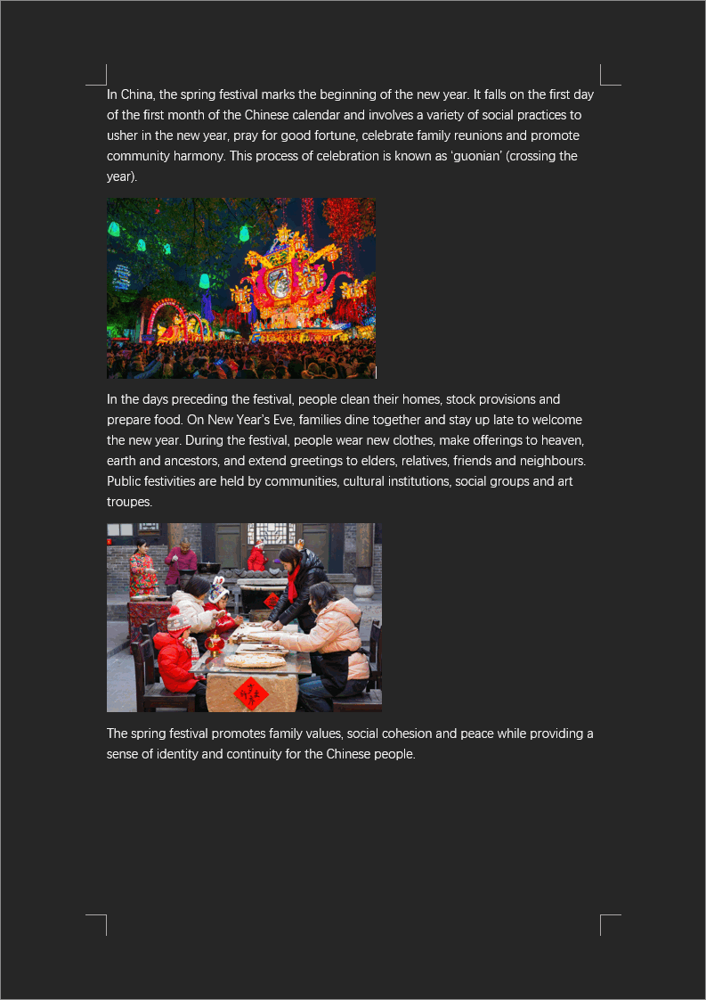

[English](./README.md) | 简体中文

# minidocx

minidocx 是一个现代、免费、开源、跨平台、轻量、易用的 C++20 库，用于生成 Word 文档（.docx 文件），遵循 [ECMA 376 5th edition](https://www.ecma-international.org/publications-and-standards/standards/ecma-376) 或 [ISO/IEC 29500-1:2016](https://www.iso.org/standard/71691.html) 标准，不依赖 MS Office 或 WPS Office。

> [!WARNING]
> minidocx 1.0 仍为预览版，不建议在生产环境中使用。

> [!NOTE]
> minidocx 0.6 可在 master 分支查看。

## 特性

- 分节
- 段落
- 富文本
- 表格
- 图片
- 样式
- 列表

## 预览

Light Mode | Dark Mode
---------- | ---------
 | 

## 示例

以下是使用 minidocx 创建 Word 文档的示例。

```cpp
#include "minidocx/minidocx.hpp"
#include <iostream>

int main()
{
  using namespace md;
  try {
    Document doc;
    SectionPointer sect = doc.addSection();

    ParagraphPointer para = sect->addParagraph();
    para->prop_.align_ = Alignment::Centered;

    RichTextPointer rich = para->addRichText(u8"中国新年快乐！");
    rich->prop_.fontSize_ = 32;
    rich->prop_.color_ = "FF0000";

    doc.saveAs("a.docx");
  }
  catch (const Exception& ex) {
    std::cerr << ex.what() << std::endl;
  }
  return 0;
}
```

## 编译

编译 minidocx 需要 C++20 编译器和 CMake 3.28。

```bash
git clone git@github.com:totravel/minidocx.git
cd minidocx

# Windows
cmake --preset x64-win-msbuild-v143
cmake --build --preset x64-win-msbuild-v143-debug
./out/x64-win-msbuild-v143/bin/exe/Debug/myapp.exe

# Linux
cmake --preset x64-linux-ninja-gcc
cmake --build --preset x64-linux-ninja-gcc-debug
./out/x64-linux-ninja-gcc/bin/exe/myapp
```

默认编译成静态库。如需编译成动态库，开启 CMake 选项 `BUILD_SHARED`。

## 文档

- [用户指南](./guide.md)

## 捐赠

如果我的项目对你有所帮助，请考虑给我一些支持和鼓励！

Alipay | WeChat Pay
------ | ----------
 | 

## 赞助

你可以通过 [爱发电](https://afdian.com/a/totravel) 赞助本项目。

你的赞助将使我可以在这个项目上投入更多的时间和精力，从而使项目得到积极的维护和更新。

## 许可

MIT
