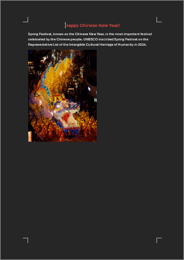
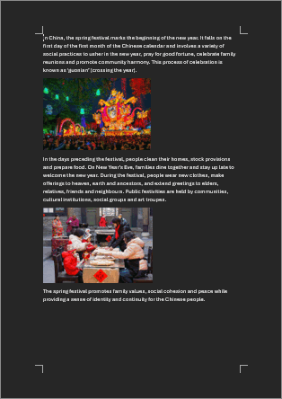

# minidocx

minidocx is a free, open-source, cross-platform, modern, lightweight and easy-to-use C++20 library for creating Microsoft Word Document (.docx file) without installing Word.

minidocx 是一个免费、开源、跨平台、现代、轻量、易用的 C++20 库，用于生成 Word 文档（.docx 文件），不依赖办公软件。

> [!WARNING]
> 
> minidocx 1.0 is currently in beta and should not be used in production.
> 
> minidocx 1.0 仍为预览版，不建议在生产环境中使用。

## Features 特性

- Section 分节
- Paragraph 段落
- Rich 富文本
- Table 表格
- Picture 图片
- List 列表
- Style 样式

## Examples 示例

Here's an example of how to use minidocx to create a .docx file.

以下是使用 minidocx 创建 Word 文档的示例。

```cpp
#include "minidocx/minidocx.hpp"
#include <iostream>

int main()
{
  using namespace md;
  try {
    Document doc;
    SectionPointer sect = doc.addSection();

    ParagraphPointer para = sect->addParagraph();
    para->properties().align_ = Alignment::Centered;

    RichTextPointer rich = para->addRichText("Happy Chinese New Year!");
    rich->properties().fontSize_ = 32;
    rich->properties().color_ = "FF0000";

    doc.saveAs("a.docx");
  }
  catch (const exception& ex) {
    std::cerr << ex.what() << std::endl;
  }
  return 0;
}
```

See other [examples](./examples).

## Screenshots 截屏

example.docx                        | picture.docx
----------------------------------- | -----------------------------------
 | 

## Building 编译

To build minidocx lib you'll need a C++20 compiler and CMake 3.28.

编译 minidocx 需要 C++20 编译器和 CMake 3.28。

```bash
git clone git@github.com:totravel/minidocx.git
cd minidocx

# Windows
cmake --preset x64-win-msbuild-v143               # Configure
cmake --build --preset x64-win-msbuild-v143-debug # Build
out/x64-win-msbuild-v143/examples/Debug/myapp.exe # Run

# Linux
cmake --preset x64-linux-ninja-gcc
cmake --build --preset x64-linux-ninja-gcc-debug
out/x64-linux-ninja-gcc/examples/myapp
```

## Donation 捐赠

Your sponsorship means a lot to me. It will help me sustain my projects actively and make more of my ideas come true. Much appreciated! 💖 🙏

如果你在工作中受益于我开发维护的项目，请考虑支持一下我的工作！

- [Buy me a coffee | 请我喝可乐](https://afdian.com/a/totravel)

## License 许可

MIT
