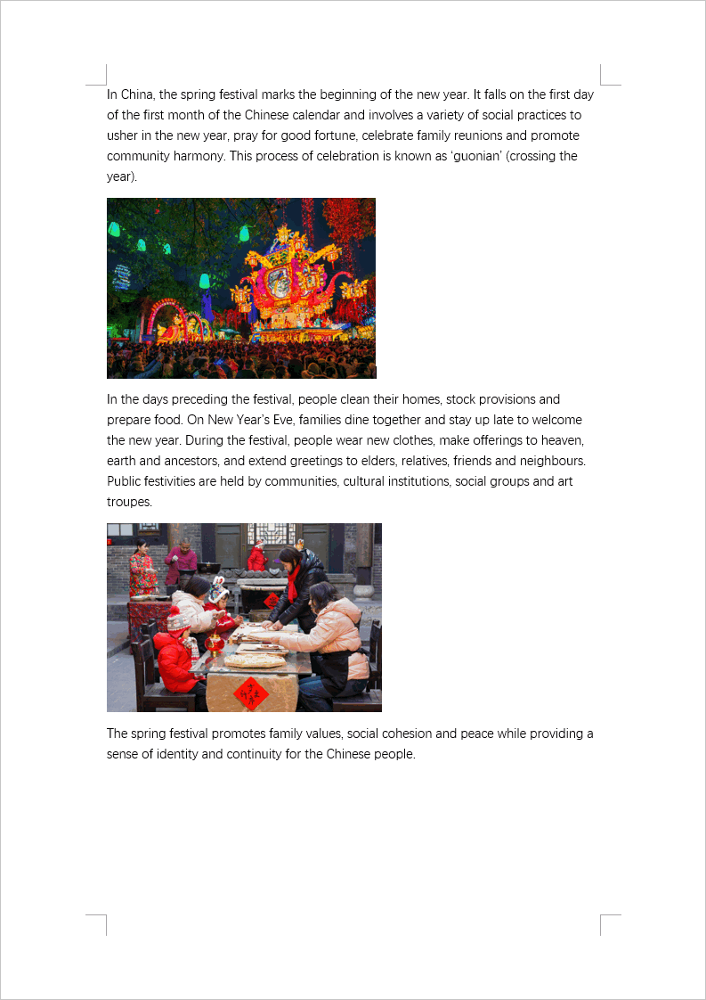

English | [简体中文](./README-zh_CN.md)

# minidocx

minidocx is a free, open-source, cross-platform, modern, light-weight and user-friendly C++20 library for creating Microsoft Word Document (.docx file) as described in [ECMA 376 5th edition](https://www.ecma-international.org/publications-and-standards/standards/ecma-376) or [ISO/IEC 29500-1:2016](https://www.iso.org/standard/71691.html) without installing MS Office or WPS Office.

> [!WARNING]
> minidocx 1.0 is currently in beta and should not be used in production.

> [!NOTE]
> Check out the master branch to view minidocx 0.6.

## Features

- Section
- Paragraph
- Rich text
- Table
- Picture
- Style
- List

## Preview

Light Mode | Dark Mode
---------- | ---------
 | 

## Example

Here's an example of how to use minidocx to create a .docx file.

```cpp
#include "minidocx/minidocx.hpp"
#include <iostream>

int main()
{
  using namespace md;
  try {
    Document doc;
    SectionPointer sect = doc.addSection();

    ParagraphPointer para = sect->addParagraph();
    para->properties().align_ = Alignment::Centered;

    RichTextPointer rich = para->addRichText("Happy Chinese New Year!");
    rich->properties().fontSize_ = 32;
    rich->properties().color_ = "FF0000";

    doc.saveAs("a.docx");
  }
  catch (const Exception& ex) {
    std::cerr << ex.what() << std::endl;
  }
  return 0;
}
```

## Building

To build minidocx lib you'll need a C++20 compiler and CMake 3.28.

```bash
git clone git@github.com:totravel/minidocx.git
cd minidocx

# Windows
cmake --preset x64-win-msbuild-v143               # Configure
cmake --build --preset x64-win-msbuild-v143-debug # Build
out/x64-win-msbuild-v143/examples/Debug/myapp.exe # Run

# Linux
cmake --preset x64-linux-ninja-gcc
cmake --build --preset x64-linux-ninja-gcc-debug
out/x64-linux-ninja-gcc/examples/myapp
```

## User Guide

Following sections describe necessary information and features supported by minidocx. Please note this description may not be complete but limited to the most useful ones. If you want to find less common features, please check header files under `include` directory.

### Measuring Units

The measuring units used in the document mainly include point (pt), twentieth of a point (tw), and English Metric Unit (emu), which are used to specify font size, page size, table width, etc. The relationship between them is shown in the table below.

|   mm |   cm |   in |   pt |   tw |    emu |
| ---: | ---: | ---: | ---: | ---: | -----: | 
|    1 |      |      |      |      |  36000 |
|      |    1 |      |      |      | 360000 |
| 25.4 | 2.54 |    1 |   72 | 1440 | 914400 |
|      |      |      |    1 |   20 |  12700 |
|      |      |      |      |    1 |    635 |

For more information, see [Lars Corneliussen's blog post](https://startbigthinksmall.wordpress.com/2010/01/04/points-inches-and-emus-measuring-units-in-office-open-xml/).

### Document Structure

A document consists of the following objects:

- Document
  - Section (Container)
    - Paragraph
      - Text
      - Picture
    - Table
      - Cell (Container)

A document consists of one or more sections. A section is a special container that have a specific set of properties used to define the pages on which its contents will appear, such as page size, page orientation, and page margins.

A container can contain two different types of block-level objects: paragraphs and tables.
 
A paragraph is a division of content that begins on a new line with a common set of properties, such as outline level, alignment, indentation, spacing, and borders. A paragraph can contain two different types of inline objects: texts and pictures.

Tables are another type of block-level objects. A table is composed of a collection of cells. Cells are also containers.

### Headers and Namespace

`minidocx.hpp` is the only one header you need to include in order to have access to all functions of minidocx and so that you do not have to care about the order of includes. All minidocx classes are member of the `md` namespace.

```cpp
#include "minidocx/minidocx.hpp"
using namespace md;
```

### Error Handling

All minidocx functions will throw an exception in case of an error. You should catch the exception to either fix it or report back to the user. All exceptions minidocx throws are objects of the class `Exception`. That's why we simply catch `Exception` objects.

```cpp
try
{
  // Do something
}
catch (const Exception& ex)
{
  std::cerr << ex.what() << std::endl;
}
```

### Object's Properties

The several objects mentioned above are instances of `Configurable` subclass, meaning that each of them is associated with a `Properties` object to store additional information and formatting properties. These associated `Properties` objects can be accessed through object's `properties()` or `setProperties()` method.

### Documents

A document is represented by a `Document` object. To create a new document and save it as `example.docx`:

```cpp
Document doc;
// Do something
doc.saveAs("example.docx");
```

A single `PackageProperties` object is created for each `Document` object. This associated `Properties` object is used to store additional information about the document, such as title, subject, author, and company.

```cpp
doc.properties().title_ = "Chinese New Year";
doc.properties().author_ = "John";
doc.properties().lastModifiedBy_ = "Peter";
```

See other avaliable document properties in [packaging/package.hpp](./include/minidocx/packaging/package.hpp).

### Sections

A section is represented by a `Section` object which can be created by making a call to the `addSection()` method on a `Document` object:

```cpp
SectionPointer sect = doc.addSection();
```

A single `SectionProperties` object is created for each `Section` object. This object is used to store formatting properties for all pages in the section, such as page size, page orientaion, page margins, etc.

```cpp
sect->properties().size_.width_ = A3_W;
sect->properties().size_.height_ = A3_H;
sect->properties().landscape_ = true;
```

See other avaliable section properties in [wordprocessing/properties/section.hpp](./include/minidocx/wordprocessing/properties/section.hpp).

### Paragraphs

A paragraph is represented by a `Paragraph` object which can be created by calling the `addParagraph()` method on a `Section` object:

```cpp
ParagraphPointer para = sect->addParagraph();
```

A single `ParagraphProperties` object is created for each `Paragraph` object to store formatting properties for the paragraph, such as alignment, outline level, indentation, spacing, etc.

```cpp
para->properties().align_ = Alignment::Centered;
para->properties().outlineLevel_ = OutlineLevel::Level1;
```

See other avaliable paragraph properties in [wordprocessing/properties/paragraph.hpp](./include/minidocx/wordprocessing/properties/paragraph.hpp).

### Rich Text

A region of text with a common set of properties is represented by a `RichText` object which can be created by calling the `addRichText()` method on a `Paragraph` object with a piece of text encoded in UTF-8 as argument. Ensure that all characters, including font names mentioned below, are encoded in UTF-8.

```cpp
RichTextPointer rich = para->addRichText(u8"Happy Chinese New Year!\n中国新年快乐！");
```

As you can see, the escape character `\n` (line break) is allowed. Note that the tab character `\t` is also allowd but the carriage return character `\r` is omitted. 

A single `RichTextProperties` object is created for each `RichText` object to store formatting properties for the text, such as font family, font size, font color, highlight, spacing, etc.

```cpp
rich->properties().font_ = { .ascii_ = "Aria", .eastAsia_ = "Simsun" };
rich->properties().fontSize_ = 32;
rich->properties().color_ = "FF0000";
```

See other avaliable properties in [wordprocessing/properties/richtext.hpp](./include/minidocx/wordprocessing/properties/richtext.hpp).

## Donation

If you benefit from this project, please consider donating to help me sustain my projects actively and make more of my ideas come true.

Alipay | WeChat Pay
------ | ----------
 | 

## Sponsor

You can sponsor this library at [AFDIAN](https://afdian.com/a/totravel).

Your sponsorship means a lot to me. It will help me sustain my projects actively and make more of my ideas come true. Much appreciated! 💖 🙏

## License

Distribution of library and components is under the MIT as listed in the file LICENSE. Examples and tests are Public Domain.
